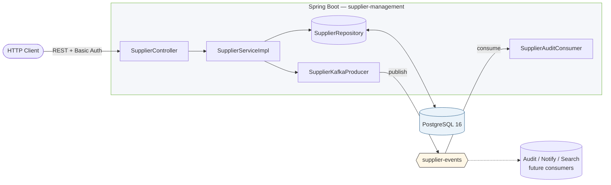

# Supplier Management Module

[](https://github.com/Shubh2-0/supplier-management/actions/workflows/ci.yml)


A production-grade **Supplier Management** backend built with **Spring Boot 3.3**, **PostgreSQL**, and **Apache Kafka**, submitted for the **BrightCore Coding Challenge**.

Every mutation and read on a supplier publishes an event to Kafka, and a reference consumer (`SupplierAuditConsumer`) reads them back — so the publish/subscribe round-trip is provably end-to-end working.

---

## Tech Stack

| Concern              | Choice                          |
| -------------------- | ------------------------------- |
| Language / JDK       | Java 17                         |
| Framework            | Spring Boot 3.3.4               |
| Persistence          | PostgreSQL 16 + Spring Data JPA |
| Migrations           | **Flyway** (versioned SQL)      |
| Messaging            | Apache Kafka (KRaft mode) — producer **+ consumer** |
| Security             | Spring Security (HTTP Basic)    |
| API Docs             | springdoc-openapi 2.6 (Swagger) |
| Build                | Maven (with `mvnw` wrapper)     |
| Container            | Multi-stage Docker + Compose    |
| CI                   | GitHub Actions (build + tests + Docker smoke) |
| Test                 | JUnit 5, Mockito, MockMvc, EmbeddedKafka |

---

## Endpoints

Base URL: `http://localhost:8080`

| Method | Path                              | Auth          | Description                                      |
| ------ | --------------------------------- | ------------- | ------------------------------------------------ |
| POST   | `/api/v1/suppliers/add`           | ADMIN         | Create a supplier — emits `SUPPLIER_CREATED`     |
| PUT    | `/api/v1/suppliers/update/{id}`   | ADMIN         | Update a supplier — emits `SUPPLIER_UPDATED`     |
| GET    | `/api/v1/suppliers/{id}`          | Authenticated | Fetch a supplier — emits `SUPPLIER_RETRIEVED`    |
| GET    | `/api/v1/suppliers?page=&size=&sort=` | Authenticated | Paginated list (bonus, beyond spec)         |
| DELETE | `/api/v1/suppliers/delete/{id}`   | ADMIN         | Delete a supplier — emits `SUPPLIER_DELETED`     |

Default credentials (override in `application.properties` or via env): `admin` / `admin123`

Swagger UI: <http://localhost:8080/swagger-ui.html>
OpenAPI JSON: <http://localhost:8080/v3/api-docs>

---

## Architecture



### Layered packages

```
controller/    REST entry points (validation, HTTP semantics)
service/       Business logic (interface + impl)
repository/    Spring Data JPA
entity/        JPA models
dto/           Request / Response DTOs (nested under SupplierDto) + PageResponse
mapper/        Entity ⇆ DTO conversion
event/         Kafka event model + EventType enum
kafka/         SupplierKafkaProducer + SupplierAuditConsumer
exception/     Domain exceptions + GlobalExceptionHandler (@RestControllerAdvice)
config/        Security, OpenAPI, Kafka topic
db/migration/  Flyway SQL — V1__init_supplier.sql
```

### Kafka topology

- **Topic:** `supplier-events`
- **Key:** supplier id (preserves per-supplier ordering)
- **Value:** JSON-serialized `SupplierEvent`
- **Acks:** `all` + idempotent producer
- Topic auto-created on broker start (3 partitions, replication factor 1 by default; configurable in `application.properties`).

Event payload:
```json
{
  "eventId": "uuid",
  "eventType": "SUPPLIER_CREATED",
  "supplierId": 1,
  "payload": { "...full SupplierResponse..." },
  "occurredAt": "2026-05-04T10:15:30Z",
  "source": "supplier-management"
}
```

---

## Quick Start — Docker (recommended)

Bring everything up (Spring Boot app + PostgreSQL + Kafka):

```bash
docker compose up --build
```

That starts:
- `supplier-postgres` on `localhost:5432`
- `supplier-kafka` on `localhost:9094` (host) / `kafka:9092` (in-network)
- `supplier-app` on `localhost:8080`

Wait for the `supplier-app` health check to settle (~30–60s), then hit:

```bash
# Create
curl -u admin:admin123 -X POST http://localhost:8080/api/v1/suppliers/add \
  -H "Content-Type: application/json" \
  -d '{"name":"Acme Textiles","email":"contact@acme.example","phoneNumber":"+91 9876543210","companyName":"Acme Pvt Ltd","country":"India"}'

# Get
curl -u admin:admin123 http://localhost:8080/api/v1/suppliers/1

# Update
curl -u admin:admin123 -X PUT http://localhost:8080/api/v1/suppliers/update/1 \
  -H "Content-Type: application/json" \
  -d '{"name":"Acme Renamed","email":"contact@acme.example","phoneNumber":"+91 9000000000","companyName":"Acme Pvt Ltd","country":"India","active":true}'

# Delete
curl -u admin:admin123 -X DELETE http://localhost:8080/api/v1/suppliers/delete/1
```

### Tail Kafka events from inside the container

```bash
docker exec -it supplier-kafka \
  kafka-console-consumer.sh --bootstrap-server localhost:9092 \
  --topic supplier-events --from-beginning
```

### Stop / clean

```bash
docker compose down            # stop
docker compose down -v         # stop + drop volumes
```

---

## Quick Start — Local (without Docker)

You need a running PostgreSQL on `localhost:5432` (db `supplierdb`, user `supplier`, password `supplier_pass`) and a Kafka broker on `localhost:9092`.

The repo ships with a **Maven wrapper** (`mvnw` / `mvnw.cmd`), so you don't need a system Maven install:

```bash
./mvnw clean spring-boot:run        # macOS / Linux
mvnw.cmd clean spring-boot:run      # Windows
```

Or build the jar and run it:

```bash
./mvnw clean package
java -jar target/supplier-management.jar
```

## Postman

Import `postman/SupplierManagement.postman_collection.json` — the collection ships with all 6 requests pre-wired (Basic Auth, env vars, test scripts that auto-capture the created supplier id).

---

## Configuration

All settings live in `src/main/resources/application.properties`. The Docker profile (`application-docker.properties`) overlays values that come from `docker-compose.yml` env vars.

| Property                                | Default                                  | Notes                                |
| --------------------------------------- | ---------------------------------------- | ------------------------------------ |
| `spring.datasource.url`                 | `jdbc:postgresql://localhost:5432/supplierdb` |                                  |
| `spring.kafka.bootstrap-servers`        | `localhost:9092`                         |                                      |
| `app.kafka.topic.supplier-events`       | `supplier-events`                        |                                      |
| `app.kafka.topic.partitions`            | `3`                                      |                                      |
| `app.security.user`                     | `admin`                                  | Override in prod                     |
| `app.security.password`                 | `admin123`                               | Override in prod                     |

---

## Tests

```bash
./mvnw test
```

Includes:
- **Unit tests** — `SupplierServiceImplTest` (business logic + event verification, Mockito)
- **Integration test** — `SupplierControllerIntegrationTest` (full HTTP flow with H2 + EmbeddedKafka)

CI runs both on every push (see `.github/workflows/ci.yml`) and additionally smoke-builds the Docker image.

---

## Project Layout

```
supplier-management/
├── Dockerfile                  # Multi-stage build (Maven → JRE)
├── docker-compose.yml          # app + postgres + kafka (KRaft)
├── pom.xml
├── README.md                   # this file
└── src/
    ├── main/
    │   ├── java/com/brightcore/suppliermanagement/
    │   │   ├── SupplierManagementApplication.java
    │   │   ├── config/
    │   │   │   ├── KafkaTopicConfig.java
    │   │   │   ├── OpenApiConfig.java
    │   │   │   └── SecurityConfig.java
    │   │   ├── controller/SupplierController.java
    │   │   ├── dto/{ApiResponse, SupplierDto}.java
    │   │   ├── entity/Supplier.java
    │   │   ├── event/{EventType, SupplierEvent}.java
    │   │   ├── exception/{GlobalExceptionHandler, ResourceNotFoundException, DuplicateResourceException}.java
    │   │   ├── kafka/SupplierKafkaProducer.java
    │   │   ├── mapper/SupplierMapper.java
    │   │   ├── repository/SupplierRepository.java
    │   │   └── service/{SupplierService, impl/SupplierServiceImpl}.java
    │   └── resources/
    │       ├── application.properties
    │       └── application-docker.properties
    └── test/
        ├── java/com/brightcore/suppliermanagement/
        │   ├── SupplierServiceImplTest.java
        │   └── SupplierControllerIntegrationTest.java
        └── resources/application-test.properties
```

---

## Design Notes

- **Flyway-managed schema** — versioned SQL in `src/main/resources/db/migration`. Hibernate runs in `validate` mode, so any drift between entities and the live schema fails fast at startup.
- **Idempotent producer + `acks=all`** — events are not silently dropped on broker hiccups.
- **Keyed messages** — events for the same supplier always land on the same partition, so downstream consumers see them in order.
- **Working consumer in-repo** — `SupplierAuditConsumer` proves end-to-end pub/sub works, not just publish-and-pray.
- **`@Transactional`** — DB write commits before the Kafka send completes; the send is async (`CompletableFuture`) with success/failure logged. For stricter outbox semantics, the next iteration would use the [Transactional Outbox](https://microservices.io/patterns/data/transactional-outbox.html) pattern.
- **Stateless Spring Security** — HTTP Basic, no sessions; trivially swappable for JWT.
- **Uniform response envelope** — every endpoint returns `ApiResponse<T>` so clients see a stable shape on success and failure.
- **Validation at the boundary** — Bean Validation annotations on DTOs; `GlobalExceptionHandler` translates failures to `400`/`404`/`409`.
- **Pagination via Spring Data `Pageable`** — `?page=&size=&sort=field,direction`, response wrapped in a stable `PageResponse<T>` envelope.
- **Multi-stage Docker build** — final image is JRE-only on Alpine, runs as a non-root user, includes a liveness `HEALTHCHECK`.
- **CI on every push** — GitHub Actions runs `mvnw verify` and a Docker smoke build.

---

## 👤 Author
*   **Shubham Bhati** (Java Backend Engineer) - [LinkedIn](https://www.linkedin.com/in/bhatishubham) | [Portfolio](https://shubhambhati.is-a.dev)
